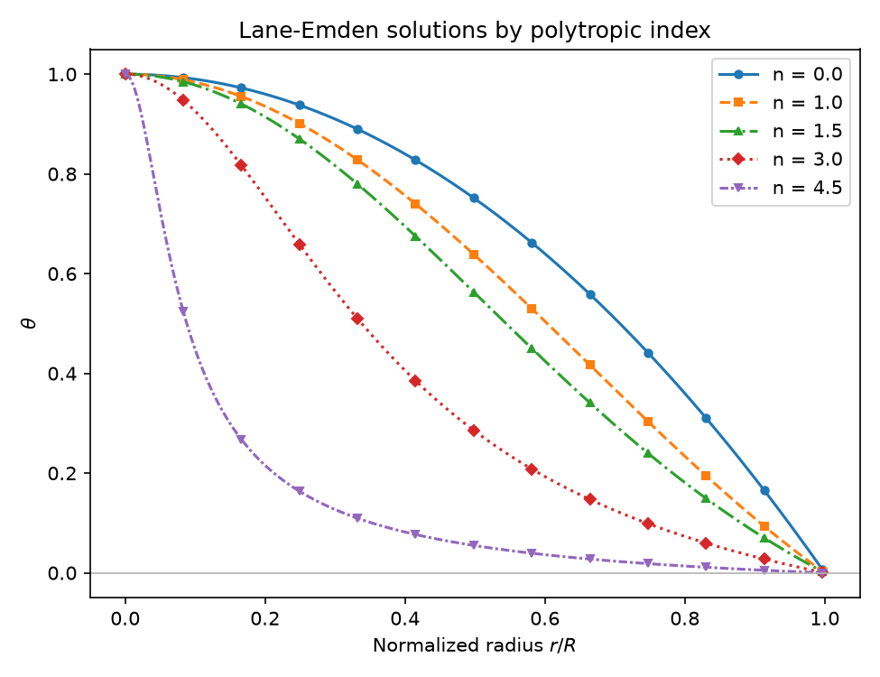
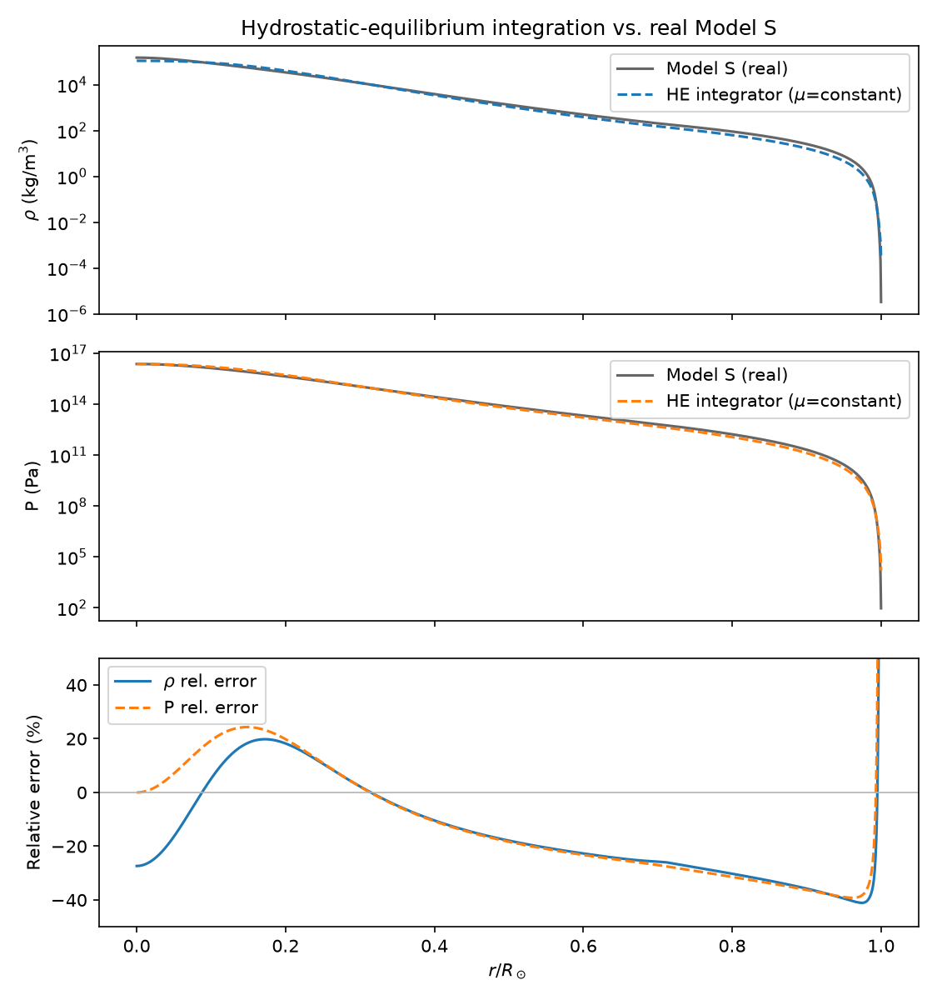

# ⭐ polystar — Lane-Emden Polytropic Star Simulator

A validated Python solver for the Lane-Emden equation — the equation that
falls out of combining Newtonian **hydrostatic equilibrium**, mass
continuity, and a polytropic equation of state (`P = K ρ^(1+1/n)`) into a
single dimensionless ODE for stellar structure. It converts the
dimensionless solution into physical density/pressure/mass profiles, is
validated against closed-form analytic solutions, and ships with a second,
independent physics path that checks a real, non-polytropic hydrostatic
integration against **Model S** — the actual helioseismically-calibrated
structure of the Sun — rather than only against itself.



## Why this exists

Most of the content on stellar structure online either stops at "here's the
Lane-Emden equation" with no working solver, or jumps straight to a full
stellar-evolution code with no validated core to build on. This project is
the numerical-methods layer in between: a solved, tested, physically
scaled Lane-Emden model, with real solar data as an external sanity check
rather than a black box compared only to itself.

## Quick start

```bash
pip install -e ".[app,dev]"
pytest                              # run the validation + test suite
python -m polystar validate         # print pass/fail against analytic + reference values
python -m polystar solve --n 1.5 --plot --export model_n1p5.csv
streamlit run app/streamlit_app.py  # interactive explorer
```

Requires Python 3.11+. Core dependencies are `numpy`, `scipy`, `matplotlib`,
`pandas`; `streamlit` is an optional `[app]` extra so the solver itself
stays lightweight (ENG-003).

## Minimal example

```python
from polystar import solve_lane_emden, scale_to_physical

model = solve_lane_emden(n=1.5)
print(model.xi_surface)                 # 3.653754 (surface, dimensionless)
print(model.surface_mass_coefficient)   # 2.714055

# With a central density and polytropic constant, get physical (SI) profiles:
physical = scale_to_physical(model, rho_c=1.5e5, K=3.8e9)
print(physical.radius, physical.total_mass)
```

## What the polytropic index represents

`n` sets how strongly pressure resists compression as density rises. `n=0`
is an incompressible, uniform-density sphere. `n=1.5` describes a fully
convective star (adiabatic, monatomic ideal gas). `n=3` is the Eddington
standard model, appropriate where radiation pressure dominates. As `n → 5`
the star's radius diverges — mass concentrates ever more toward the center
while the outer envelope thins to nothing, which is exactly what the
comparison figure above shows.

## Validation

Validation is a first-class deliverable, not a footnote:

| Case | Check | Result |
|---|---|---|
| n = 0 | ξ₁ vs. √6 (analytic) | agrees to ~1e-16 relative error |
| n = 1 | ξ₁ vs. π (analytic) | agrees to ~5e-12 relative error |
| n = 1.5 | ξ₁, mass coefficient vs. tabulated reference | agrees to ~1e-6 |
| n = 3 | ξ₁, mass coefficient vs. tabulated reference | agrees to ~2e-7 |
| all n | Lane-Emden residual, interior | < 1e-3 |
| all n | enclosed mass monotonicity | verified |

Run `python -m polystar validate` or see the **Validation** tab in the
Streamlit app for live pass/fail output, and [docs/validation.md](docs/validation.md)
for the full methodology.

## Real-data comparison: hydrostatic equilibrium vs. the actual Sun

Alongside the polytropic solver, [`he_integrator.py`](src/polystar/he_integrator.py)
integrates hydrostatic equilibrium and mass continuity **without** assuming
a polytropic P-ρ relation. It closes the system with the ideal-gas law and
the real temperature profile from
[Model S](https://users-phys.au.dk/jcd/solar_models/)
(Christensen-Dalsgaard et al. 1996, *Science* 272, 1286) — genuine,
published, helioseismically-calibrated solar structure data, bundled under
[`src/polystar/data/model_s_cptrho.dat`](src/polystar/data/model_s_cptrho.dat).



With a constant mean molecular weight (μ ≈ 0.62, an independent
assumption), the integration tracks the real Sun's density and pressure to
within a few tens of percent through most of the interior — visibly
diverging in the outer envelope, where partial ionization actually changes
μ. Deriving μ(r) from Model S's own P, ρ, T instead reproduces the real
profile to within ~0.1%, which is the expected result and mainly serves as
a correctness check on the integrator itself (see the docstring in
`he_integrator.py` for why this comparison isn't circular in the
constant-μ case but is in the derived-μ case).

## Deploying the app for free

The Streamlit app is a static-data, CPU-only, single-user tool, which fits
comfortably in [Streamlit Community Cloud](https://streamlit.io/cloud)'s
free tier (the first-party host for Streamlit apps, no credit card):

1. Sign in at [share.streamlit.io](https://share.streamlit.io) with the
   `kentlritchie` GitHub account and authorize it to read this repo.
2. **New app** → repository `kentlritchie/polystar`, branch `main`, main
   file path `app/streamlit_app.py`.
3. Under **Advanced settings**, set the Python version to 3.11. The root
   [`requirements.txt`](requirements.txt) is picked up automatically.
4. Deploy. It lands at a URL like `https://polystar.streamlit.app` (exact
   subdomain depends on availability) and redeploys automatically on every
   push to `main`.

Free-tier apps sleep after a period of inactivity and take a few seconds to
wake back up on the next visit — expected behavior, not a bug.

**Alternative:** [Hugging Face Spaces](https://huggingface.co/spaces) also
hosts Streamlit apps for free (choose the "Streamlit" SDK when creating a
Space) if you'd rather not use Streamlit's own host.

## Project structure

```text
polystar/
├── pyproject.toml
├── README.md
├── LICENSE
├── src/polystar/
│   ├── lane_emden.py       # dimensionless Lane-Emden ODE solver
│   ├── models.py           # LaneEmdenSolution / PhysicalProfile / SolverConfig
│   ├── scaling.py          # rho_c, K -> physical SI profiles
│   ├── diagnostics.py      # analytic + reference validation, residual checks
│   ├── model_s_data.py     # real Model S loader (bundled data)
│   ├── he_integrator.py    # non-polytropic HE integration vs. real Model S
│   ├── plotting.py         # all figures, shared by CLI/Streamlit/notebooks
│   ├── constants.py        # SI physical constants, with source attribution
│   ├── __main__.py         # `python -m polystar ...` CLI
│   └── data/model_s_cptrho.dat
├── app/streamlit_app.py    # interactive explorer (uses only the public API)
├── tests/                  # pytest suite
└── docs/
    ├── physics.md
    ├── numerical_methods.md
    └── validation.md
```

The physics engine (`src/polystar/`) has no UI dependency and no
file-system side effects outside of explicit export calls — the CLI,
Streamlit app, and any future notebooks all call the same public functions.

## Model assumptions and limitations

- The Lane-Emden solver assumes a strict polytropic relation `P = K ρ^(1+1/n)`
  throughout the star; it does not model energy transport, generation, or
  composition gradients.
- Physical scaling (`scale_to_physical`) is undefined at `n = 0`, where
  `P = K ρ^(1+1/n)` itself requires `1/n`.
- The HE integrator uses the ideal-gas law, which is only approximate in
  partially-ionized zones and does not hold at all under electron
  degeneracy (white-dwarf interiors).
- Model S's own tabulated grid does not extend to exactly `r = 0`; the
  bundled loader takes its innermost point as the central boundary
  condition rather than extrapolating.

## Future work

This is deliberately staged. Already pulled forward from the original
roadmap: non-polytropic hydrostatic-equilibrium integration against real
solar data (§18.1/§18.3 of the original requirements spec). Still ahead:

- Approximate pp-chain / CNO energy generation and a coupled `dL/dr`.
- Opacity models and a radiative/convective temperature gradient, closing
  the loop into a genuine (simplified) stellar-evolution code.
- Electron-degeneracy pressure for white-dwarf interiors, and the
  Chandrasekhar-limit mass-radius relation.
- The Tolman-Oppenheimer-Volkoff equation for relativistic compact stars.
- A theoretical counterpart to observational solar-data tooling — e.g.
  comparing this project's structure predictions against DKIST-derived
  photospheric measurements.

## Testing

```bash
pytest
```

Covers: central series-expansion values, ODE right-hand-side behavior,
derived density/mass quantities, end-to-end analytic and reference-value
validation, surface-event detection, edge cases (`n < 0` rejection, `n`
near 5), physical scaling (including its `n=0` failure mode), the real
Model S data loader, and the HE-integrator comparison against it.

## License

[MIT](LICENSE).
